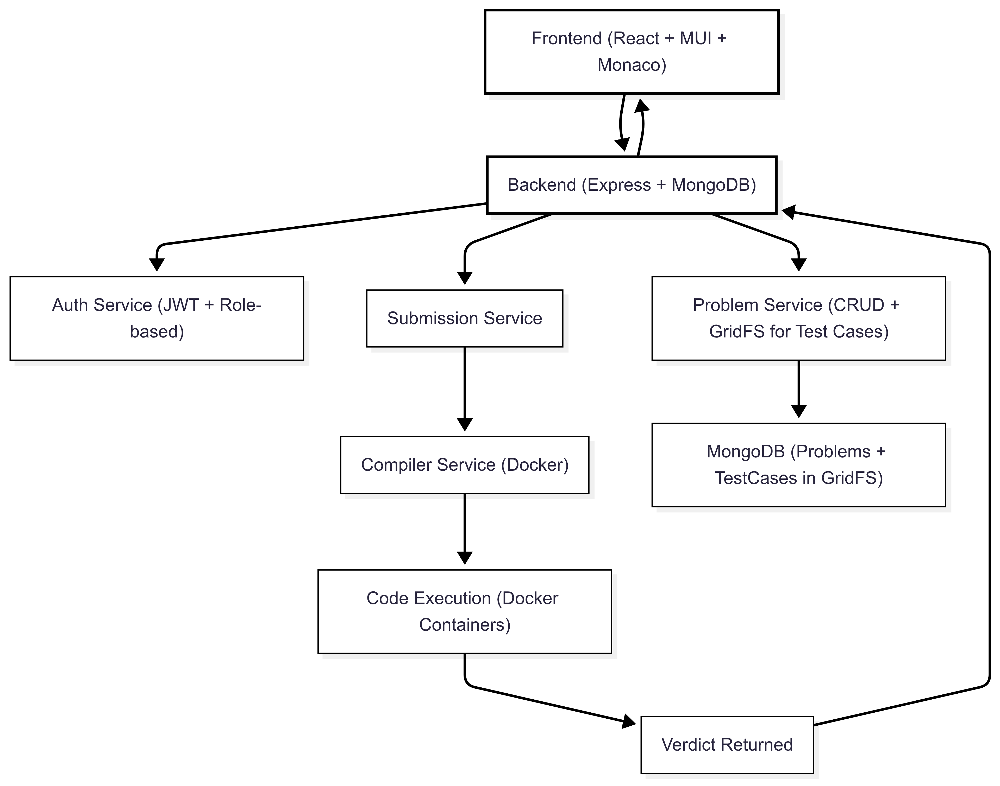

# 🧠 Online Judge System 

This project is a microservices-based Online Judge system designed to manage coding problems, user submissions, and code evaluations at scale. The architecture promotes modularity, scalability, and ease of maintenance.
## 🔗 Project Links

- **🌐 Live Project**: [View Deployed App](https://dev-project-aj2v4vtls-pranshu-goels-projects.vercel.app)
- **📁 GitHub Repository**: [GitHub - Dev Project](https://github.com/Pranshu2504/Dev-Project)
- **🎥 Demo Video**: [Loom](https://www.loom.com/share/d4231eaf55fd45dc9e85a5a3d7e68d28?sid=ce570aeb-53b8-4ee1-9c6e-8160f92148e4)

## 📚 Architecture Diagram

## 🧱 Services Overview

### 🚪 API Gateway
- Acts as a single entry point for all frontend requests.
- Routes API calls to corresponding backend services.

### 👤 User Service
- Handles user registration, login

### 📘 Problem Service
- Stores and serves coding problems and sample test cases.

### 📨 Submission Service
- Accepts submissions and stores results.
- Sends submissions to the Evaluator Service.
- Receives results and updates the database.

### ⚙️ Evaluator Service
- Executes code submissions in a secure sandbox environment.
- Returns execution results to the Submission Service.

### 🔁 Evaluator (Polling)
- Continuously polls Submission Service for results.
- Displays verdict and output back to the frontend.

### 🌐 Frontend
- Provides UI for users to interact with the system.
- Communicates with API Gateway.

## 🔁 Request Flow

1. Frontend sends request to **API Gateway**.
2. Gateway routes request to User, Problem, or Submission Service.
3. Submission Service sends the code to Evaluator Service.
4. Evaluator runs the code and returns result.
5. Evaluator polls Submission Service and updates the UI.

## 🧪 Tech Stack

- **Backend**: Node.js, Express
- **Frontend**: React / Next.js,Monaco
- **Database**: MongoDB 
- **Containerization**: Docker
- **Code Execution**: Docker-based sandbox

